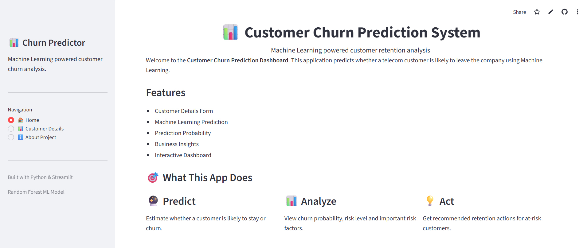
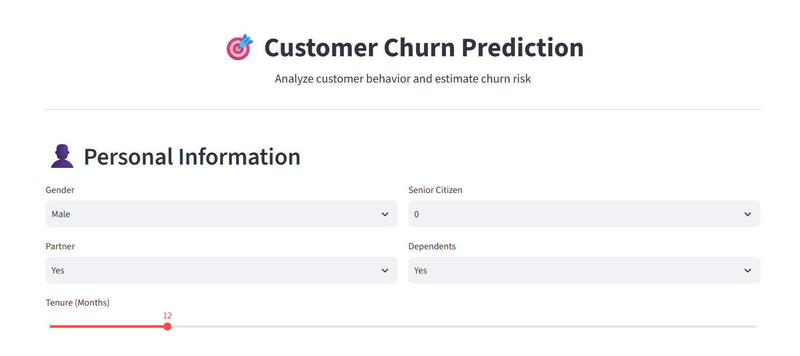
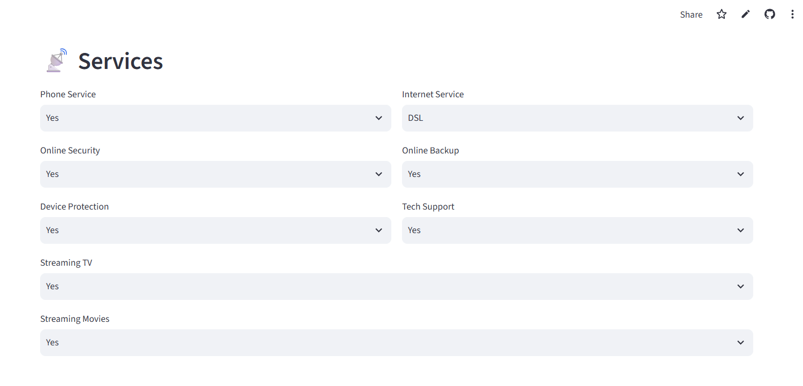
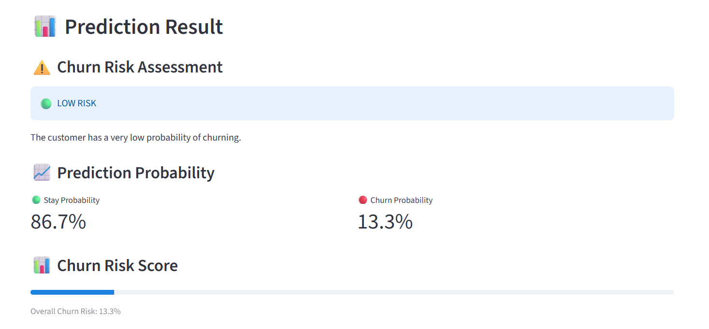
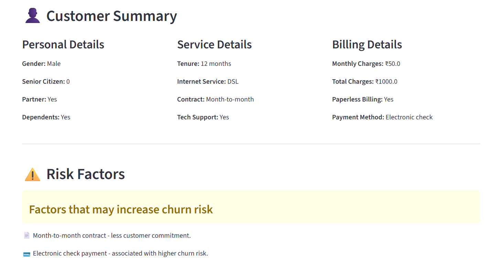
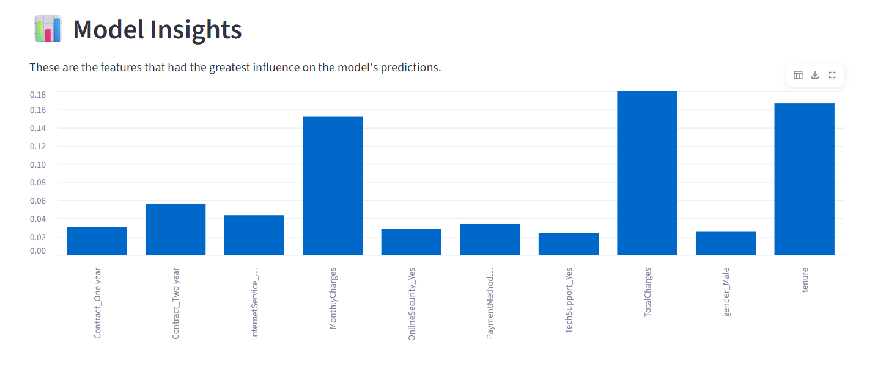

\#🚀 Customer Churn Prediction System

\# Predict customer churn using Machine Learning

🌐 **[Live Demo](https://customer-churn-prediction-tpkaq5xdvowlspqyj3fnqz.streamlit.app/)** • 💻 **[GitHub Repository](https://github.com/darshitt15/Customer-Churn-Prediction)**

---

\# 📌 Project Overview

Customer Churn Prediction System is a machine learning application that predicts whether a customer is likely to churn based on their service usage, contract details, billing information, and other customer attributes.

The project uses a Random Forest classification model and provides an interactive Streamlit interface for real-time predictions, churn risk assessment, and retention recommendations.

\# ✨ Features

- Customer churn prediction
- Stay vs. churn probability
- Risk classification
- Churn risk factors
- Retention recommendations
- Model insights and feature importance
- Interactive Streamlit interface

---

\- Interactive Streamlit interface

&#x20; - Home page

&#x20; - Customer Details page

&#x20; - About Project page


\# Machine Learning Model


The project uses a \*\*Random Forest Classifier\*\* to predict customer churn.


\# Target Variable


The target variable is: `Churn`


The target contains two classes:


\- `0` = No Churn

\- `1` = Churn


\# Dataset


The project uses the \*\*IBM Telco Customer Churn Dataset\*\*.


The dataset contains customer information including:


\- Gender

\- Senior Citizen

\- Partner

\- Dependents

\- Tenure

\- Phone Service

\- Internet Service

\- Online Security

\- Online Backup

\- Device Protection

\- Tech Support

\- Contract

\- Paperless Billing

\- Payment Method

\- Monthly Charges

\- Total Charges


\## Technologies Used


\- Python

\- Pandas

\- NumPy

\- Scikit-learn

\- Random Forest Classifier

\- Joblib

\- Streamlit


\## Model Performance


The current model achieved the following results:


| Metric        | Score |

|---------------|-------|

| Accuracy      | 76%   |

| Churn Recall  | 63%   |

| ROC-AUC       | 0.82  |


The ROC-AUC score indicates that the model has a good ability to distinguish between customers who are likely to churn and customers who are likely to stay.


\# Streamlit Application


The Machine Learning model is integrated into a Streamlit web application.


The application allows users to:


\- Enter customer information

\- Submit the customer profile

\- Generate a churn prediction

\- View stay probability

\- View churn probability

\- View the customer's risk level

\- Identify potential churn risk factors

\- View important model features

\- Receive a recommended retention action


\# Risk Assessment


The application classifies customers based on their predicted churn probability.


| Churn Probability | Risk Level     |

|--------------------|----------------|

| Below 20%          | Low Risk       |

| 20% – 34%          | Moderate Risk  |

| 35% – 49%          | High Risk      |

| 50% or above       | Critical Risk  |


The risk level is used to help understand which customers may require additional attention.


\# Project Workflow


```

Customer Data

&#x20;     ↓

Data Preprocessing

&#x20;     ↓

Feature Engineering

&#x20;     ↓

Train-Test Split

&#x20;     ↓

Random Forest Model

&#x20;     ↓

Model Evaluation

&#x20;     ↓

Model Saving

&#x20;     ↓

Streamlit Application

&#x20;     ↓

Customer Prediction

&#x20;     ↓

Risk Assessment

&#x20;     ↓

Retention Recommendation

```


\## Business Value


Customer churn prediction can help businesses:


\- Identify customers who may be at risk of leaving

\- Prioritize customer retention efforts

\- Improve customer satisfaction

\- Reduce potential revenue loss

\- Make data-driven business decisions

\- Develop targeted retention strategies


\# Project Structure


```

Customer-Churn-Prediction/

│

├── app.py

├── README.md

├── requirements.txt

│

├── data/

│   └── telco\_customer\_churn.csv

│

├── models/

│   ├── customer\_churn\_model.pkl

│   └── model\_columns.pkl

│

└── notebook/

&#x20;   └── customer\_churn\_analysis.ipynb

```

\# Application Preview

\# Home Page


\# Customer Churn Prediction



\# Result Page


\# Summary Page



\# Model Insights



\# How to Run the Project


\# Step 1: Clone the Repository


```bash

git clone YOUR\_GITHUB\_REPOSITORY\_URL

```


\# Step 2: Open the Project Folder


```bash

cd Customer-Churn-Prediction

```


\# Step 3: Install Dependencies


```bash

pip install -r requirements.txt

```


\# Step 4: Run the Streamlit Application


```bash

streamlit run app.py

```


The application will open in your web browser.


\# Example Prediction


The application can provide results such as:


\*\*Prediction: Likely to Stay\*\*


\- Stay Probability: 97%

\- Churn Probability: 3%

\- Risk Level: LOW RISK


For a customer with a higher churn probability:


\*\*Prediction: Likely to Stay\*\*


\- Stay Probability: 63%

\- Churn Probability: 37%

\- Risk Level: HIGH RISK


The application displays both the predicted class and the probability distribution, allowing users to understand the model's confidence and the customer's potential risk.


\# Risk Factors


The application identifies selected customer characteristics that may be associated with increased churn risk, such as:


\- Short customer tenure

\- Month-to-month contracts

\- Higher monthly charges

\- Lack of technical support

\- Electronic check payment

\- Certain internet service characteristics


These factors are presented to help interpret the prediction and support potential customer retention strategies.


\# Model Insights


The application also displays the most important features used by the Random Forest model.


Feature importance helps provide an understanding of which customer characteristics have the greatest influence on the model's predictions.


\# Retention Recommendations


Based on the predicted churn probability, the application provides different recommendations:


\- \*\*Low Risk:\*\* No immediate retention action required.

\- \*\*Moderate Risk:\*\* Monitor the customer and consider proactive engagement.

\- \*\*High Risk:\*\* Consider proactive retention efforts.

\- \*\*Critical Risk:\*\* Immediate retention action is recommended.


These recommendations are intended as business-support suggestions and not as automatic decisions.


\# Future Improvements


The project can be further enhanced by adding:


\- Downloadable prediction reports

\- Customer retention history

\- Interactive data visualizations

\- Model comparison

\- Hyperparameter tuning

\- Explainable AI techniques

\- Real-time customer data integration

\- Cloud deployment

\- Automated model retraining


\# Conclusion


This project demonstrates how Machine Learning can be used to address a real-world business problem such as customer churn.


By combining a Random Forest classification model with an interactive Streamlit application, the system provides not only a churn prediction but also probability scores, risk assessment, feature insights, and potential retention recommendations.


The project demonstrates practical skills in:


\- Data preprocessing

\- Exploratory data analysis

\- Feature engineering

\- Machine Learning

\- Model evaluation

\- Model deployment

\- Data visualization

\- Building interactive applications


\# Developed By


Darshit Bangera

